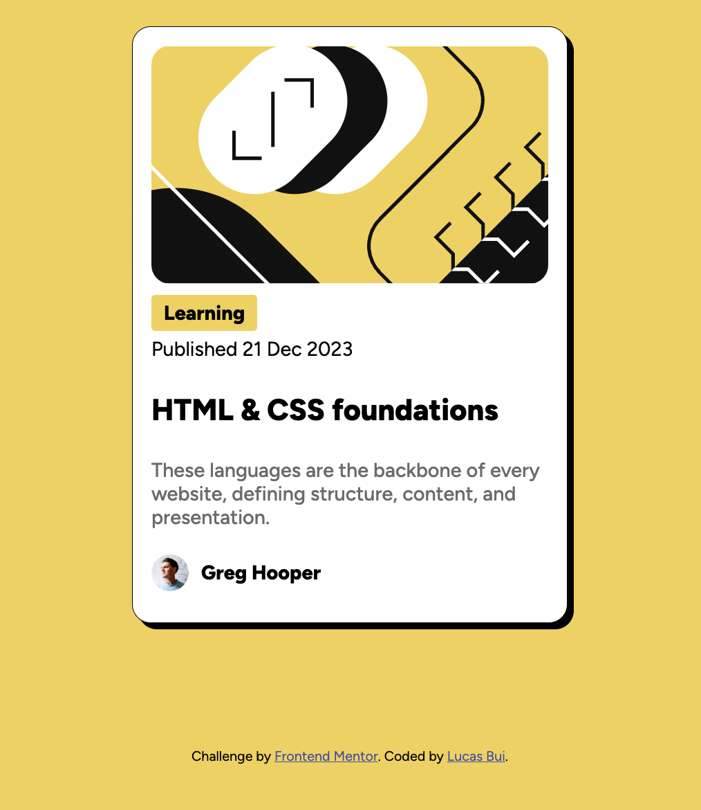

# Frontend Mentor - Blog preview card solution

This is a solution to the [Blog preview card challenge on Frontend Mentor](https://www.frontendmentor.io/challenges/blog-preview-card-ckPaj01IcS). Frontend Mentor challenges help you improve your coding skills by building realistic projects. 

## Table of contents

- [Overview](#overview)
  - [The challenge](#the-challenge)
  - [Screenshot](#screenshot)
  - [Links](#links)
- [My process](#my-process)
  - [Built with](#built-with)
  - [What I learned](#what-i-learned)
- [Author](#author)

## Overview

### The challenge

Users should be able to:
- Simple UI for card display
### Screenshot

### Links

- Solution URL: [URL](https://github.com/lucasbui69/blog-preview-card)
- Live Site URL: [URL](https://lucasbui69.github.io/blog-preview-card/)

## My process

### Built with

- Semantic HTML5 markup
- CSS custom properties
- Flexbox
- Mobile-first workflow

### What I learned
- Center avatar components align with the text

## Author

- Website - [Lucas Bui](https://www.lucasbui.com)
- Frontend Mentor - [@yourusername](https://www.frontendmentor.io/profile/lucasbui88)

